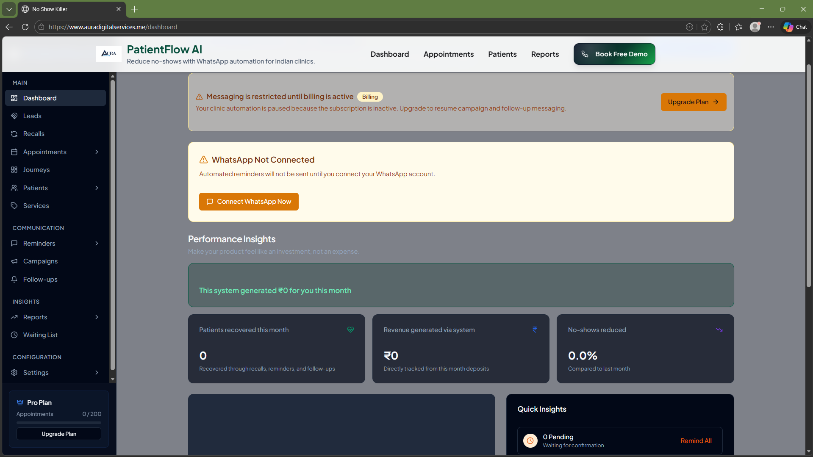

Update all contact information throughout the site to reflect our actual Indian market presence:

1. Replace phone number with: +91 [your real number] or remove if not ready
2. Replace address with: "Bangalore, Karnataka, India" or "Remote-first, serving clinics across India"
3. Replace email with: support@auradigitalservices.me (verify this domain works first)
4. Update footer copyright from "PatientFlow AI" to consistent branding
5. If PatientFlow AI domain doesn't exist, remove the email or use a working one

Check these files:
- Footer component
- Contact page
- Pricing page (if it has contact info)
- Any "Get in Touch" sections

CRITICAL: Do NOT use placeholder/fake contact info. If you're not ready to provide real contact, remove the section entirely.

Add a social proof section on the homepage (only if we have ANY real data):

IF we have beta users:
- Add section after hero: "Trusted by Clinics Across India"
- Show: "[X] Active Clinics | [Y] Patients Engaged | [Z] Messages Sent"
- Use REAL numbers even if small: "5 Beta Clinics" > "100+ Clinics" (fake)

IF we have zero users yet:
- SKIP testimonials section entirely
- Add "Early Access Program" CTA instead:
  - "Join 50 clinics in our pilot program"
  - "Limited spots: 15 remaining"
  - "Free for first 60 days in exchange for feedback"

DO NOT add fake testimonials. DO NOT use stock photos with made-up quotes.

If uncertain, remove all social proof sections until we earn them.

Refactor homepage messaging to target dental clinics specifically:

1. Update hero headline to:
   "Turn Your Dental Clinic's WhatsApp Into an Automated Booking Machine"

2. Update subheadline to:
   "Recover ₹40,000+/month from missed appointments. Built for Indian dental practices."

3. Replace generic "clinic" language with dental-specific terms:
   - "dental consultations" instead of "appointments"
   - "recall patients for cleanings" instead of "follow-ups"
   - "root canal confirmation" instead of "booking confirmation"

4. Update visual demo to show dental-specific conversation:
   - Patient asking about "teeth cleaning appointment"
   - Bot responding with "Dr. Sharma has a slot tomorrow at 3 PM"

5. Add dental-specific pain points:
   - "30% of cleaning recalls never book"
   - "20% no-show rate on RCT appointments"
   - "Front desk buried in WhatsApp during peak hours"

Keep the broader "skin, general clinics" language on secondary pages, but make homepage LASER focused on dental.

Rationale: It's easier to dominate one vertical than be mediocre in three.

Redesign the "Book Free Demo" flow for maximum conversion:

Current: Generic button → Unknown destination

New flow:

1. Create /book-demo page with:
   - Headline: "See No Show Killer in Action"
   - Subheadline: "15-minute demo showing how we reduce no-shows by 30%"
   
2. What's covered (bullet points):
   - Live WhatsApp automation demo
   - ROI calculator for your clinic
   - Implementation timeline (48 hours)
   - Pricing and plans walkthrough
   
3. Calendly/Cal.com embed for instant booking

4. Form fields (minimal):
   - Name
   - Clinic name
   - Phone number (WhatsApp)
   - Dropdown: "Monthly appointments?" (50-100 / 100-200 / 200-500 / 500+)
   
5. After form submission:
   - Redirect to thank you page
   - Show: "Check WhatsApp for confirmation"
   - Auto-send WhatsApp message: "Thanks for booking! Your demo is on [DATE] at [TIME]"

6. Reminder sequence:
   - 24 hours before: WhatsApp reminder
   - 1 hour before: WhatsApp reminder with Zoom link
   
Make the ENTIRE flow demonstrate our product (use our own automation for demo booking).

Add India-market trust signals to landing page:

1. Payment section:
   - "Secure payments via Razorpay" (show logo)
   - "All prices in INR"
   - "GST invoicing available"

2. Compliance section:
   - "GDPR-compliant data handling"
   - "Hosted on secure Indian servers"
   - "No patient data shared with third parties"

3. Language toggle (if applicable):
   - Option to view in Hindi/Kannada
   - WhatsApp flows support regional languages

4. Local presence:
   - "Built in India, for Indian healthcare"
   - "Serving clinics in Bangalore, Mumbai, Delhi, Pune" (if true)

5. WhatsApp verification badge:
   - "Official WhatsApp Business Solution Provider Partner" (if applicable)
   - Or "Powered by Gupshup (Meta Partner)"

6. Replace any Western imagery:
   - If using stock photos, ensure they look Indian (doctors, clinic settings)
   - Currency symbols: ₹ not $
   - Phone numbers: +91 format
   
Remove all US-centric elements (addresses, phone numbers, visual references).

Build an interactive ROI calculator widget on homepage:

Position: After hero section, before features

Inputs (sliders):
1. Monthly appointments: 100-500 (default: 200)
2. Current no-show rate: 10-40% (default: 25%)
3. Average appointment value: ₹500-₹5000 (default: ₹1500)

Calculations:
- Monthly no-shows = appointments × no-show rate
- Monthly revenue lost = no-shows × appointment value
- With No Show Killer (reduce no-shows by 50%):
  - New no-show rate = current × 0.5
  - Revenue recovered = (old no-shows - new no-shows) × appointment value
  - Annual impact = revenue recovered × 12

Output display:
- "You're losing ₹[X]/month to no-shows"
- "No Show Killer could save you ₹[Y]/month"
- "Annual revenue recovered: ₹[Z]"
- "ROI: [R]% (our ₹8,999/month fee vs ₹[Y] saved)"

CTA button below: "Get This ROI for Your Clinic" → links to /book-demo

Design:
- Card with gradient background
- Real-time updates as sliders move
- Mobile-responsive
- Use Recharts for small visualization if helpful

Make numbers REAL and conservative (50% reduction is achievable, not 90%).

Audit and fix all linked pages:

Check these links are working:
- /privacy → Privacy Policy page
- /terms → Terms of Service page
- /how-it-works → How it works page
- /features → Features page
- /about → About page
- /pricing → Pricing page
- /signup → Signup flow
- /book-demo → Demo booking

For each MISSING page, either:
1. Create a real, functional page, OR
2. Remove the link from navigation

Priority pages to create if missing:

1. /privacy (use template):
   - What data we collect
   - How we use it
   - GDPR compliance
   - Contact for data requests

2. /terms (use template):
   - Service terms
   - Payment terms
   - Refund policy
   - Acceptable use

3. /how-it-works (critical for SEO):
   - Step-by-step flow with visuals
   - Integration process
   - Onboarding timeline
   - FAQs

Do NOT link to pages that don't exist or show generic "Coming Soon" placeholders.

Ensure mobile experience is perfect:

Test on:
- iPhone SE (small screen)
- iPhone 14 Pro (notch)
- Android (various sizes)

Check:
1. Hero section readable on mobile
2. CTA buttons thumb-friendly (44px+ height)
3. WhatsApp demo visual is responsive
4. Pricing cards stack vertically
5. Forms are mobile-friendly (large inputs)
6. Navigation menu works (hamburger on mobile)

Specific fixes:
- Hero headline: Reduce font size on mobile (clamp())
- Pricing: Single column stack on <768px
- WhatsApp demo: Show condensed version on mobile
- Forms: Full-width inputs with proper spacing

Add mobile-specific improvements:
- Click-to-call on phone number (tel: link)
- Click-to-WhatsApp CTA (wa.me link)
- Sticky mobile header with CTA

Test page speed on mobile (aim for <3s load time).Implement basic SEO for Indian clinic market:

1. Update meta tags:
   - Title: "No Show Killer - Reduce Clinic No-Shows with WhatsApp Automation"
   - Description: "Indian dental & skin clinics use No Show Killer to recover ₹40,000+/month from missed appointments. WhatsApp automation, booking, reminders & recalls. Try free."
   - Keywords: "clinic appointment software India, WhatsApp clinic automation, reduce no-shows, dental clinic software, patient recall system"

2. Create location pages (if targeting specific cities):
   - /bangalore
   - /mumbai
   - /delhi
   - Each with city-specific content and local SEO

3. Blog content (minimum 5 articles):
   - "How to Reduce No-Shows in Your Dental Clinic by 30%"
   - "WhatsApp Business API for Healthcare: Complete Guide"
   - "Patient Recall Systems: Best Practices for Indian Clinics"
   - "ROI Calculator: Is Appointment Automation Worth It?"
   - "Dental Clinic Operations: Common Mistakes Costing You Revenue"

4. Schema markup:
   - LocalBusiness schema
   - Product schema for pricing
   - FAQ schema for common questions

5. Image optimization:
   - Compress all images
   - Add descriptive alt text
   - Use WebP format

6. Performance:
   - Lazy load images
   - Minimize JavaScript
   - Target 90+ Lighthouse score

Focus on long-tail Indian healthcare keywords, not competing with global giants.Set up infrastructure for A/B testing key elements:

Variants to test:

1. Hero Headline:
   A: "Turn Missed Inquiries into Booked Patients Automatically"
   B: "Recover ₹40,000/Month From No-Shows & Missed Follow-ups"
   C: "WhatsApp Automation That Books Appointments While You Sleep"

2. Primary CTA:
   A: "Book Free Demo"
   B: "Start Free Trial"
   C: "See How It Works"

3. Pricing display:
   A: Monthly only
   B: Annual (show savings)
   C: Both with toggle

Use Vercel Analytics or Google Optimize for tracking.

Metrics to track:
- Demo booking rate
- Time on page
- Scroll depth
- CTA click-through rate

Run each test for minimum 100 visitors before deciding winner.